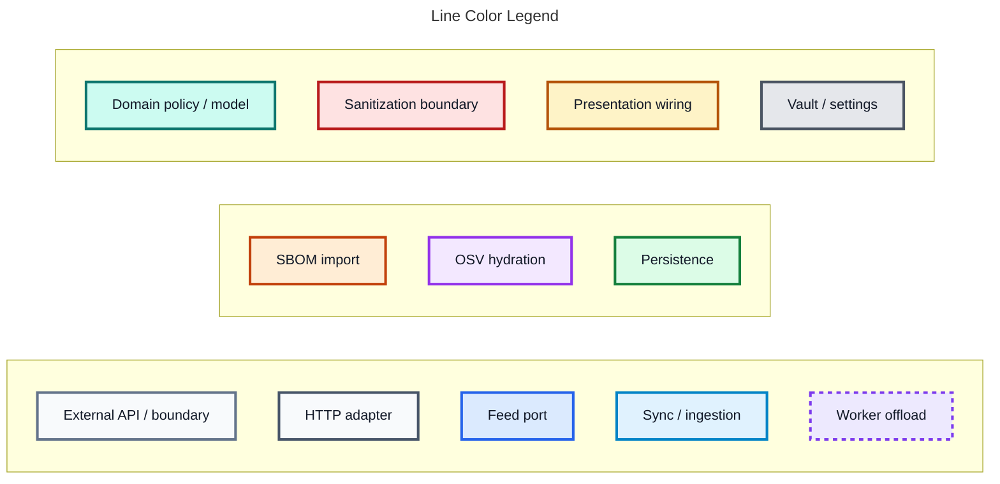
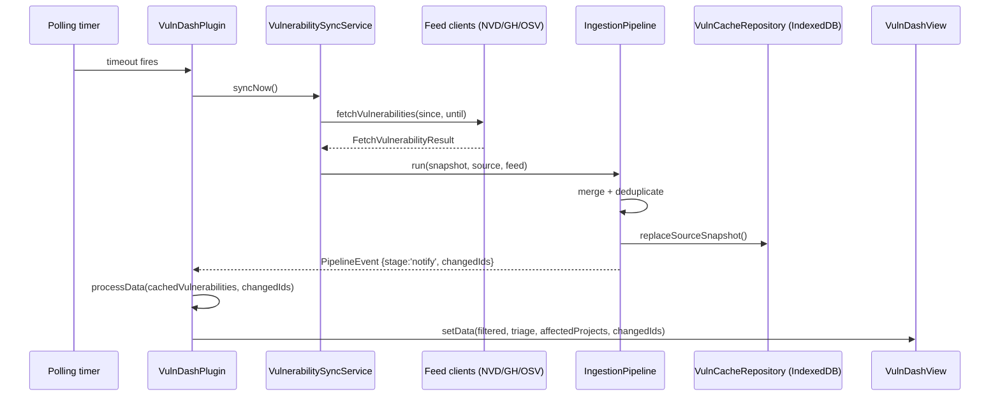
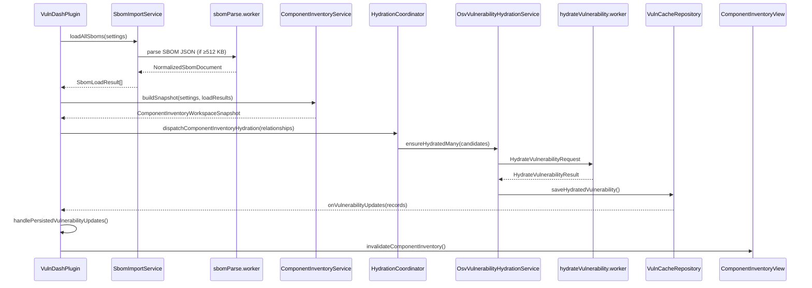
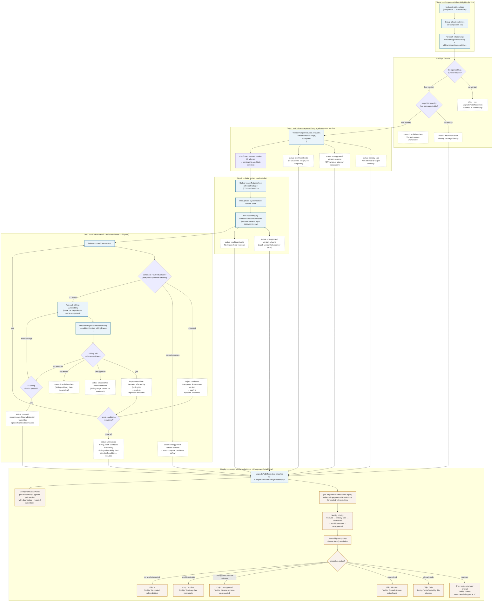

# VulnDash Architecture

Obsidian plugin for vulnerability intelligence, SBOM analysis, and triage. Built with Clean Architecture and DDD — dependency direction flows inward: `presentation → application → domain`, `infrastructure → application / domain`.

## Layer Overview

```
src/
  domain/          # Pure TS — entities, value objects, policies, domain services
  application/     # Use cases, ports, orchestration, pipeline, SBOM services
  infrastructure/  # Feed clients, IndexedDB repos, Web Workers, parsers, HTTP
  presentation/    # Obsidian views, modals, settings tab, commands, renderers
tests/             # Mirrors src/ structure; domain tests are pure, no mocks
```


---

### Link Legend
The legend uses colored boxes to avoid adding dummy legend arrows that would shift Mermaid's order-sensitive `linkStyle` indexes. The actual diagram arrows are color-coded with `linkStyle` at the bottom of the Mermaid block.



## System Architecture

```mermaid
---
title: System Architecture
config:
  htmlLabels: false
---

flowchart LR
    
    subgraph External["External APIs"]
        direction LR
        NVD["NVD REST API"]
        GHA["GitHub Advisory API"]
        REPO["GitHub Repo Advisory API"]
    end

    subgraph External2["External APIs"]
      OSV["OSV API"]
    end
    
    subgraph Infra["infrastructure/"]
        direction TB
        NvdClient["NvdClient"]
        GHClient["GitHubAdvisoryClient"]
        RepoClient["GitHubRepoClient"]
        OsvClient["OsvVulnerabilityHydrationService"]
        HTTP["HttpClient<br/>(requestUrl)"]
        CycloneDx["CycloneDxParser"]
        Spdx["SpdxParser"]
        ParserFactory["SbomParserFactory"]
        VulnDB[("VulnCacheDb<br/>(IndexedDB v4)")]
        VulnRepo["VulnCacheRepository"]
        TriageRepo["IndexedDbTriageRepository"]
        SyncMeta["SyncMetadataRepository"]
        SbomMapping["SbomProjectMappingRepository"]
        CredStore["CredentialStore"]
        NoteWriter["DailyRollupNoteWriter"]
        ProjectNotes["ProjectNoteLookupService"]
        SbomIdx["SbomComponentIndex"]
        CoopSched["CooperativeScheduler"]
        AsyncCoord["AsyncTaskCoordinator"]
        CachePruner["CachePruner"]
        CacheHydrator["CacheHydrator"]
        Sanitize["sanitize.ts<br/>(XSS guard)"]
    end

    subgraph Workers["Web Workers"]
        WNorm["normalize.worker<br/>(VulnerabilityBatchNormalizer)"]
        WParse["sbomParse.worker<br/>(SbomParserFactory)"]
        WRender["renderDailyRollup.worker"]
        WHydrate["hydrateVulnerability.worker<br/>(OsvHydrationClient + FetchHttpClient)"]
    end

    subgraph App["application/"]
        direction TB
        AppModule["VulnDashAppModule<br/>(composition root)"]
        SyncSvc["VulnerabilitySyncService"]
        Pipeline["IngestionPipeline"]
        Normalizer["VulnerabilityBatchNormalizer"]
        AlertEng["AlertEngine"]
        SbomImport["SbomImportService"]
        SbomCatalog["SbomCatalogService"]
        SbomFilter["SbomFilterMergeService"]
        CompInv["ComponentInventoryService"]
        CompLink["ComponentVulnerabilityLinkService"]
        CompPref["ComponentPreferenceService"]
        HydCoord["DefaultVulnerabilityHydrationCoordinator"]
        JoinTriage["JoinTriageState"]
        SetTriage["SetTriageState"]
        RollupGen["DailyRollupGenerator"]
        ResolveProj["ResolveAffectedProjects"]
        SettingsMig["SettingsMigrator"]
    end

    subgraph Domain["domain/"]
        direction TB
        Vuln["Vulnerability<br/>(entity)"]
        SbomDoc["SbomDocument<br/>(entity)"]
        TriageRec["TriageRecord"]
        Severity["Severity / CvssScore<br/>(value objects)"]
        HydState["VulnerabilityHydrationState"]
        ComplPolicy["VulnerabilityMetadataCompletenessPolicy"]
        SeverityPolicy["VulnerabilitySeverityPolicy"]
        PkgId["PackageIdentity"]
        UpgradePath["UpgradePathResolution"]
        NormSev["normalizeVulnerabilitySeverity"]
    end

    subgraph Presentation["presentation/"]
        Plugin["VulnDashPlugin<br/>(Plugin lifecycle)"]
        View["VulnDashView<br/>(ItemView)"]
        CompView["ComponentInventoryView"]
        SettingsTab["VulnDashSettingsTab<br/>(PluginSettingTab)"]
        Modals["BriefingScopeModal<br/>SbomManagerModal"]
        Commands["GenerateDailyRollupCommand"]
        VTable["VirtualizedComponentTable"]
        SevBadge["SeverityBadgeRenderer"]
        MdCompose["VulnerabilityMarkdownComposer<br/>DailyRollupMarkdownComposer"]
    end

    subgraph Vault["Obsidian Vault"]
        SbomFiles["SBOM files<br/>(.json)"]
        RollupNotes["Daily Rollup Notes<br/>(.md)"]
        PluginData["plugin data.json<br/>(settings + cursors)"]
    end

    %% Styling Classes
    classDef ui fill:#f9f2ec,stroke:#b26b00,stroke-width:1.5px,color:#333
    classDef application fill:#eaf4fa,stroke:#005b96,stroke-width:1.5px,color:#333
    classDef infrastructure fill:#f4f4f4,stroke:#666,stroke-width:1.5px,color:#333
    classDef storage fill:#e1f7e7,stroke:#2d7a42,stroke-width:2px,color:#333
    classDef dataNode fill:#ffffff,stroke:#888,stroke-width:1px,stroke-dasharray: 4 4,color:#333

    %% Presentation nodes
    class Plugin,View,CompView,SettingsTab,Modals,Commands,VTable,SevBadge,MdCompose ui

    %% Application nodes
    class AppModule,SyncSvc,Pipeline,Normalizer,AlertEng,SbomImport,SbomCatalog,SbomFilter,CompInv,CompLink,CompPref,HydCoord,JoinTriage,SetTriage,RollupGen,ResolveProj,SettingsMig application
    %% Domain nodes also use application style (pure business logic, inner-most layer)
    class Vuln,SbomDoc,TriageRec,Severity,HydState,ComplPolicy,SeverityPolicy,PkgId,UpgradePath,NormSev application

    %% Infrastructure nodes
    class NvdClient,GHClient,RepoClient,OsvClient,HTTP,CycloneDx,Spdx,ParserFactory,VulnRepo,TriageRepo,SyncMeta,SbomMapping,CredStore,NoteWriter,ProjectNotes,SbomIdx,CoopSched,AsyncCoord,CachePruner,CacheHydrator,Sanitize,WNorm,WParse,WRender,WHydrate infrastructure

    %% Storage node
    class VulnDB storage

    %% External API and Vault nodes (data / boundary nodes)
    class NVD,GHA,REPO,OSV,SbomFiles,RollupNotes,PluginData dataNode

    %% External → Infrastructure
    NVD -->|HTTP| NvdClient
    GHA -->|HTTP| GHClient
    REPO -->|HTTP| RepoClient
    OSV -->|HTTP| WHydrate

    NvdClient --> HTTP
    GHClient --> HTTP
    RepoClient --> HTTP

    %% Infrastructure → Application (feed ports)
    NvdClient -->|VulnerabilityFeed| SyncSvc
    GHClient -->|VulnerabilityFeed| SyncSvc
    RepoClient -->|VulnerabilityFeed| SyncSvc

    %% Sync pipeline
    SyncSvc --> Pipeline
    Pipeline -->|batches| Normalizer
    Normalizer -.->|offload| WNorm
    Pipeline --> VulnRepo
    Pipeline -->|PipelineEvent| Plugin

    %% SBOM flow
    SbomFiles -->|read| SbomImport
    SbomImport --> ParserFactory
    ParserFactory --> CycloneDx
    ParserFactory --> Spdx
    SbomImport -.->|offload large files| WParse

    %% OSV lazy hydration
    HydCoord -->|ensureHydratedMany| OsvClient
    OsvClient -.->|CPU work| WHydrate
    WHydrate -->|result| OsvClient
    OsvClient -->|saveHydratedVulnerability| VulnRepo
    VulnRepo -->|onVulnerabilityUpdates| Plugin

    %% Persistence
    VulnRepo --> VulnDB
    TriageRepo --> VulnDB
    SyncMeta --> VulnDB
    CachePruner --> VulnDB
    CacheHydrator --> VulnDB

    %% Application wiring
    AppModule --> SyncSvc
    AppModule --> SbomImport
    AppModule --> CompInv
    AppModule --> HydCoord
    AppModule --> RollupGen
    AppModule --> ResolveProj

    SbomImport --> SbomCatalog
    SbomImport --> SbomFilter
    CompInv --> CompLink
    CompLink --> Vuln
    CompLink --> SbomDoc

    JoinTriage --> TriageRepo
    SetTriage --> TriageRepo

    %% Domain used by App + Infra
    NvdClient --> NormSev
    GHClient --> NormSev
    RepoClient --> NormSev
    NormSev --> Severity
    NormSev --> HydState
    ComplPolicy --> HydState
    SeverityPolicy --> Severity
    HydCoord --> ComplPolicy
    Pipeline --> UpgradePath
    Pipeline --> PkgId

    %% Sanitization boundary
    NvdClient --> Sanitize
    GHClient --> Sanitize
    RepoClient --> Sanitize

    %% Presentation → Application
    Plugin --> AppModule
    Plugin --> SyncSvc
    Plugin --> JoinTriage
    Plugin --> SetTriage
    Plugin --> HydCoord
    View --> CompView
    View --> VTable
    View --> SevBadge
    View --> MdCompose
    SettingsTab --> Plugin
    Modals --> Plugin
    Commands --> Plugin

    %% Rollup
    RollupGen -->|compose| MdCompose
    RollupGen -.->|offload| WRender
    RollupGen --> NoteWriter
    NoteWriter --> RollupNotes

    %% Vault / settings
    SbomImport --> SbomFiles
    Plugin -->|loadData/saveData| PluginData
    CredStore --> PluginData
    ProjectNotes -->|getMarkdownFiles| Vault
    SbomMapping -->|updateSbomConfig| Plugin

    %% Line / edge color coding
    %% NOTE: Mermaid linkStyle indexes are order-sensitive. If new arrows are inserted above, update these groups.

    %% External API traffic
    linkStyle 0,1,2,3 stroke:#64748b,stroke-width:2px;

    %% Shared HTTP adapter calls
    linkStyle 4,5,6 stroke:#475569,stroke-width:1.8px;

    %% Feed ports into application sync
    linkStyle 7,8,9 stroke:#2563eb,stroke-width:2.5px;

    %% Sync / ingestion pipeline
    linkStyle 10,11,13,14 stroke:#0284c7,stroke-width:2.5px;

    %% Worker offload paths
    linkStyle 12,19,21,69 stroke:#7c3aed,stroke-width:2.5px,stroke-dasharray:5 5;

    %% SBOM import flow
    linkStyle 15,16,17,18 stroke:#c2410c,stroke-width:2.5px;

    %% OSV lazy hydration flow
    linkStyle 20,22,23,24 stroke:#9333ea,stroke-width:2.5px;

    %% Persistence / IndexedDB
    linkStyle 25,26,27,28,29 stroke:#15803d,stroke-width:2.5px;

    %% Application composition and internal use cases
    linkStyle 30,31,32,33,34,35,36,37,38,39,40,41,42 stroke:#0369a1,stroke-width:2px;

    %% Domain model / policy usage
    linkStyle 43,44,45,46,47,48,49,50,51,52 stroke:#0f766e,stroke-width:2.25px;

    %% Sanitization boundary
    linkStyle 53,54,55 stroke:#b91c1c,stroke-width:2.75px;

    %% Presentation wiring
    linkStyle 56,57,58,59,60,61,62,63,64,65,66,67 stroke:#b45309,stroke-width:2.25px;

    %% Rollup / note generation
    linkStyle 68,70,71 stroke:#6d28d9,stroke-width:2.25px;

    %% Vault / settings access
    linkStyle 72,73,74,75,76 stroke:#4b5563,stroke-width:2px;
```



---

## Data Flow — Vulnerability Sync



---

## Data Flow — SBOM Import & Hydration



---

## Layer Dependency Rules

| Layer | May import from | Must NOT import from |
|---|---|---|
| `domain/` | nothing outside domain | application, infrastructure, presentation, `obsidian` |
| `application/` | domain, application ports | infrastructure details, `obsidian`, DOM |
| `infrastructure/` | domain, application ports | presentation, `obsidian` views/modals |
| `presentation/` | application, infrastructure adapters, `obsidian` | — |

---

## Remediation Engine Workflow



---

## Key Design Decisions

| Decision | Rationale |
|---|---|
| IndexedDB (v4 schema) for persistence | Survives Obsidian restarts; supports large vulnerability sets without memory pressure |
| Web Workers for SBOM parsing, normalization, rollup rendering, hydration | Keeps Obsidian UI thread responsive for large files and network-heavy operations |
| `CooperativeScheduler` + `AsyncTaskCoordinator` | Prevents duplicate concurrent tasks; yields to the event loop to avoid UI starvation |
| `VulnerabilitySyncService` dataProcessingChain | Serializes all `processDataInternal` calls to prevent race conditions on `cachedVulnerabilities` |
| `IngestionPipeline` with `PipelineRunRegistry` | Tracks run lifecycles; enables incremental sync and safe cursor advancement after full success |
| Lazy OSV hydration via `DefaultVulnerabilityHydrationCoordinator` | CVSS details fetched on demand; in-flight deduplication prevents duplicate OSV calls |
| Semver remediation allowlist stays narrow (`npm`, `yarn`) | Non-npm ecosystems diverge in version semantics; each new ecosystem needs a dedicated evaluator and regression tests before it can participate in upgrade-path calculation |
| `CredentialStore` - encrypted plugin data | API keys never stored as plaintext; migration-safe serialization on settings save |
| Sanitize boundary in infrastructure clients | All external advisory text passed through `sanitizeText`/`sanitizeMarkdown`/`sanitizeUrl` before entering domain models |
| Managed Markdown section markers in rollup notes | Auto-generated sections are safely replaced without destroying analyst-authored content |
